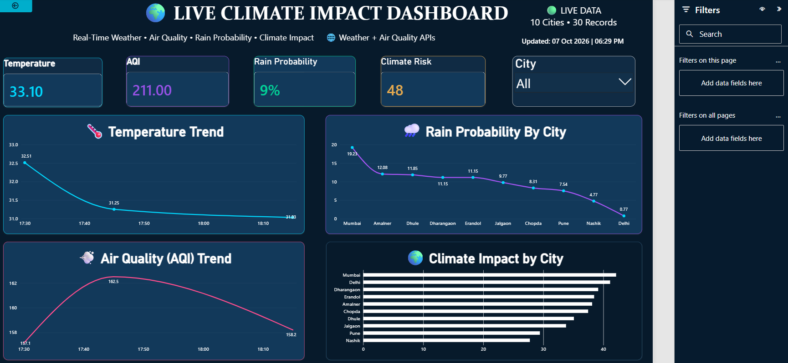

# 🌍 Live Climate Impact Dashboard

A real-time Climate Impact Analytics Dashboard built using **Python, Weather & Air Quality APIs, MySQL, and Power BI**.

The project collects live weather and air-quality data, calculates a Climate Impact Score, stores the processed data in MySQL, and visualizes the results in an interactive Power BI dashboard.

---

## 📊 Dashboard Preview



---

## 🚀 Project Features

- 🌡️ Real-time temperature monitoring
- 🟣 Live Air Quality Index (AQI)
- 🌧️ Rain probability analysis
- 🌍 Climate Impact Score
- 🏙️ City-wise climate comparison
- 📈 Temperature trend analysis
- 📊 AQI trend analysis
- 🔄 Historical climate data tracking
- 🗄️ MySQL data storage
- 📊 Interactive Power BI dashboard

---

## 🛠️ Technologies Used

- Python
- Pandas
- Open-Meteo Weather API
- Open-Meteo Air Quality API
- MySQL
- Power BI
- DAX
- Git & GitHub

---

## 🔄 Data Pipeline

```text
Weather API
     ↓
Air Quality API
     ↓
Data Collection
     ↓
Data Combination
     ↓
Climate Impact Score
     ↓
MySQL Database
     ↓
Power BI Dashboard


👨‍💻 Author
Shubham Kumbhar
Data Analytics | Python | SQL | Power BI
- GitHub: https://github.com/SK-datahub
- LinkedIn: https://www.linkedin.com/in/sk-datahub/